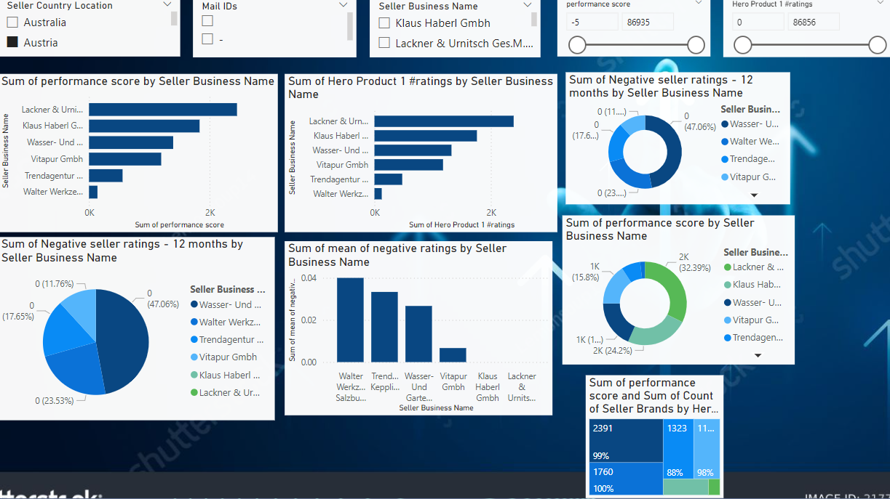

# Data Visualization and Performance Score Calculation

## Overview

This project focuses on visualizing data using Power BI and Python to determine selection criteria and calculate a performance score for sellers. The performance score was designed to evaluate sellers based on various factors including product ratings, negative seller ratings, and the number of seller brands.
## Visualization

## Selection Criteria

The selection criteria for evaluating seller performance is calculated as follows:

**Performance Score** = (Hero Product 1 #ratings) - (Max % of negative seller ratings - last 12 months * 10) + (Count of seller brands * 5)

- **Hero Product 1 #ratings:** The number of ratings received by the top-selling product of the seller.
- **Max % of negative seller ratings - last 12 months:** The highest percentage of negative ratings received by the seller in the past 12 months.
- **Count of seller brands:** The total number of brands associated with the seller.

## Project Structure

- **Scripts:** Contains Python scripts for data processing and score calculation.
- **Visualizations:** Power BI files and exported images of the visualizations created.
- **Documentation:** Detailed explanation of the methods used, including the rationale behind the selection criteria and performance score calculation.

## Usage

1. **Clone the repository:** `git clone https://github.com/AnshSharma2521/Amazon-Dataset-Cleaning-and-Best-seller-criteria-calculation-using-Power-BI-and-Python.git`
2. **Run the scripts** to process data and calculate the performance score.
3. **Explore the visualizations** to gain insights into the seller performance metrics.

## Author:
Ansh Sharma

